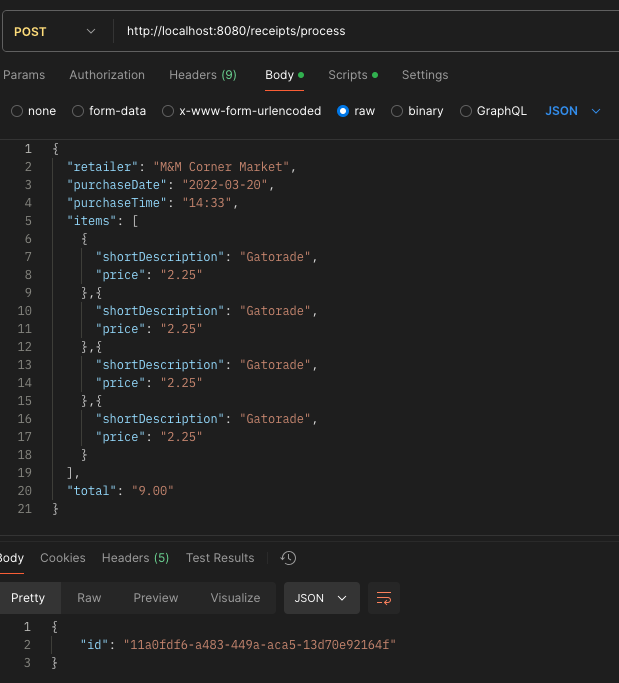

# How to Run 
Inside the receipt-processor directory
1) docker build -t receipt-processor-image .
2) docker run -p 8080:8080 --name receipt-processor-container receipt-processor-image

# How to test endpoints
Using Postman: 
1) Make a POST request with request data at endpoint:
   http://localhost:8080/receipts/process

**Example:**

2) Make a GET request with id of Receipt:
http://localhost:8080/receipts/{id}/points

**Example**

